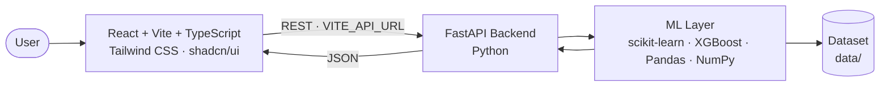
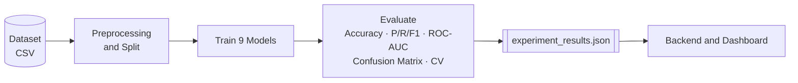

<div align="center">

# EDU-NEXUS

### An Educational Data Science Framework for Student Outcome Analytics

*Analyze, visualize, and predict academic outcomes, from raw student records to actionable insight.*

<br>


[Overview](#overview) · [Architecture](#system-architecture) · [Machine Learning](#machine-learning) · [Quick Start](#quick-start) · [Deployment](#deployment) · [Roadmap](#roadmap)

</div>

---

## Overview

**EDU-NEXUS** is a full-stack educational analytics platform that combines an interactive React dashboard, a FastAPI service layer, and a machine-learning pipeline to study and predict student academic outcomes.

The ML core frames the problem as a **three-class classification task**: predicting whether a student will be a **Dropout**, remain **Enrolled**, or **Graduate**. Nine classical and ensemble models are benchmarked side by side on the same dataset, so the trade-offs between accuracy, class-level recall, and training cost are visible rather than assumed.

### Why it exists

Institutions typically learn that a student is at risk only after the outcome has already happened. EDU-NEXUS explores whether historical academic and demographic records can be used to flag risk earlier, and does so with transparent, reproducible model comparisons instead of a single opaque score.

### Highlights

- **End-to-end stack.** React/TypeScript frontend, FastAPI backend, scikit-learn/XGBoost modelling.
- **Transparent benchmarking.** Nine models evaluated on identical splits with accuracy, macro precision/recall/F1, ROC-AUC, confusion matrices, cross-validation scores and training time.
- **Environment-driven configuration.** API URL and CORS origins are set through environment variables, not hardcoded.
- **Documented deployment path.** See [`DEPLOYMENT.md`](DEPLOYMENT.md) and [`DEPLOYMENT_READINESS.md`](DEPLOYMENT_READINESS.md).
- **Academic documentation included.** Full project report and pitch deck live in the repository.

---

## System Architecture



| Layer | Responsibility |
|---|---|
| **Frontend** (`src/`) | Dashboards, charts, forms and routing; talks to the backend via `VITE_API_URL`. |
| **Backend** (`backend/`) | FastAPI application (`main:app`), CORS handling, data and model services. |
| **ML / Data** (`data/`, root scripts) | Dataset, experiment runner, benchmark results. |

---

## Technology Stack

| Area | Technologies |
|---|---|
| **Frontend** | React 18, TypeScript 5, Vite 5, Tailwind CSS 3, shadcn/ui on Radix UI primitives |
| **State, routing, forms** | TanStack Query, React Router 6, React Hook Form, Zod |
| **Visualization & export** | Recharts, react-markdown (+ remark-gfm), jsPDF / jsPDF-AutoTable |
| **Backend** | Python 3.9+, FastAPI, Uvicorn |
| **Machine learning** | scikit-learn, XGBoost, Pandas, NumPy |
| **Testing & quality** | Vitest, Testing Library, ESLint 9 |

---

## Machine Learning

### Problem formulation

| Item | Detail |
|---|---|
| **Task** | Multi-class classification |
| **Classes** | `Dropout`, `Enrolled`, `Graduate` |
| **Evaluation set** | 885 samples (derived from the confusion matrices in `experiment_results.json`) |
| **Class support** | Dropout 316 · Enrolled 151 · Graduate 418 |
| **Dataset file** | `EduNexus_Extended_Real_Dataset (2) (2).csv` |
| **Results artifact** | [`experiment_results.json`](experiment_results.json) |

### ML pipeline



### Model benchmark

Metrics below are taken directly from [`experiment_results.json`](experiment_results.json). Precision, recall and F1 are macro-averaged. Best value in each column is in **bold**.

| Model | Accuracy | Precision | Recall | F1 | ROC-AUC | CV Score | Train Time (s) |
|---|:---:|:---:|:---:|:---:|:---:|:---:|:---:|
| Logistic Regression | 0.7503 | 0.6829 | 0.6545 | 0.6605 | 0.8695 | 0.7660 | 6.60 |
| Decision Tree | 0.6927 | 0.6372 | 0.6394 | 0.6376 | 0.7413 | 0.6748 | 0.49 |
| Random Forest | **0.7763** | **0.7189** | 0.6910 | 0.6991 | 0.8739 | 0.7739 | 5.10 |
| SVM | 0.7605 | 0.6984 | 0.6623 | 0.6702 | 0.8701 | 0.7672 | 16.91 |
| KNN | 0.7062 | 0.6226 | 0.6003 | 0.6026 | 0.8031 | 0.7189 | 3.60 |
| Naive Bayes | 0.7017 | 0.6407 | 0.6126 | 0.6187 | 0.8249 | 0.7214 | **0.14** |
| Gradient Boosting | 0.7616 | 0.6957 | 0.6734 | 0.6794 | 0.8783 | **0.7779** | 24.26 |
| AdaBoost | 0.7333 | 0.6443 | 0.6301 | 0.6298 | 0.8330 | 0.7561 | 2.50 |
| XGBoost | 0.7718 | 0.7169 | **0.6928** | **0.7005** | **0.8827** | 0.7680 | 68.47 |

### Key observations

- **Ensembles lead.** Random Forest has the highest accuracy (77.6%), while XGBoost leads on macro recall, macro F1 and ROC-AUC (0.883). The two are within about 0.5 points of accuracy of each other.
- **Cost differs sharply.** XGBoost took roughly 68 s to train versus about 5 s for Random Forest in the recorded run, so the accuracy gain from boosting is small relative to its compute cost.
- **The `Enrolled` class is the hard one.** Derived from the confusion matrices, per-class recall for Random Forest is roughly 77% (Dropout), 38% (Enrolled), and 92% (Graduate). XGBoost shows a similar pattern at about 75%, 41%, and 92%. Overall accuracy therefore overstates how reliably intermediate-status students are identified.
- **Single run.** These figures come from one recorded experiment. They should not be read as confidence intervals.

### Explainability

The results schema reserves a `shap` field per model, but it is **empty in the committed `experiment_results.json`**. SHAP-based explanations are therefore treated as *in progress* until populated.

---

## Repository Structure

```text
EDU-NEXUS/
├── backend/                     # FastAPI application (main:app) and requirements.txt
├── src/                         # React + TypeScript frontend source
├── public/                      # Static assets
├── data/                        # Datasets
├── EDUNEXUS/                    # Additional project resources
├── final_report/                # Report build output
│
├── run_experiments.py           # Model benchmarking runner
├── experiment_results.json      # Recorded benchmark metrics
├── generate_results_chapter.py  # Report utility (results chapter)
├── build_ch1_4.py, build_ch5_8.py   # Report build utilities
├── start_edunexus.ps1           # Windows launcher script
│
├── index.html, vite.config.ts, vitest.config.ts
├── tailwind.config.ts, postcss.config.js, components.json
├── tsconfig*.json, eslint.config.js
│
├── .env.example                 # Environment template
├── DEPLOYMENT.md                # Deployment guide
├── DEPLOYMENT_READINESS.md      # Deployment readiness report
├── START.md                     # Startup notes
└── README.md
```

---

## Quick Start

**Prerequisites:** Node.js 18+ · Python 3.9+ · Git

```bash
# 1. Clone
git clone https://github.com/kiyotakaaKira/EDU-NEXUS.git
cd EDU-NEXUS

# 2. Configure environment
cp .env.example .env          # Windows (PowerShell): Copy-Item .env.example .env

# 3. Start the backend (terminal 1)
cd backend
python -m venv .venv
source .venv/bin/activate     # Windows: .venv\Scripts\activate
pip install -r requirements.txt
python -m uvicorn main:app --reload --port 8000

# 4. Start the frontend (terminal 2, from the repository root)
npm install
npm run dev
```

| Service | Default URL |
|---|---|
| Frontend (Vite) | `http://localhost:5173` |
| Backend API | `http://localhost:8000` |
| Interactive API docs (Swagger UI) | `http://localhost:8000/docs` |

> On Windows, `start_edunexus.ps1` is included as a launcher; see [`START.md`](START.md) for details.

---

## Configuration

Copy `.env.example` to `.env` and adjust. Never commit `.env`.

| Variable | Scope | Description |
|---|---|---|
| `VITE_API_URL` | Frontend | Base URL of the FastAPI backend (e.g. `http://localhost:8000`). Must be set **before** `npm run build`. |
| `CORS_ORIGINS` | Backend | Comma-separated list of allowed frontend origins (e.g. `http://localhost:5173,https://yourdomain.com`). |
| `VITE_ANTHROPIC_API_KEY` | Frontend | Listed in the deployment guide. **See the security note below before using a real key.** |

> **Security note.** Any variable prefixed with `VITE_` is embedded into the public JavaScript bundle at build time and is visible to every visitor. A real third-party API key must **not** be supplied this way in production. Route such calls through the backend and keep the key server-side.

---

## Development

| Task | Command |
|---|---|
| Start dev server | `npm run dev` |
| Production build | `npm run build` |
| Development-mode build | `npm run build:dev` |
| Preview production build | `npm run preview` |
| Lint | `npm run lint` |
| Run tests (once) | `npm test` |
| Watch tests | `npm run test:watch` |
| Reproduce model benchmark | `python run_experiments.py` *(run from the root with the backend environment active)* |

---

## API

The backend is a FastAPI application, so the authoritative, always-current endpoint reference is the auto-generated Swagger UI at **`/docs`** (and ReDoc at `/redoc`) once the server is running.

```bash
# Verify the server is up
curl http://localhost:8000/docs
```

---

## Deployment

Full instructions are in [`DEPLOYMENT.md`](DEPLOYMENT.md). In summary:

| Component | Approach |
|---|---|
| **Frontend** | `npm run build` produces static files in `dist/`. Serve from Nginx, Vercel, Netlify or any static host. Set `VITE_API_URL` first. |
| **Backend** | Run `uvicorn main:app --host 0.0.0.0 --port 8000` from `backend/`. Suitable for Docker, Render, Heroku-style platforms, or a VPS with Gunicorn/systemd. |
| **CORS** | Set `CORS_ORIGINS` to the deployed frontend origin(s). |
| **ML artifacts** | If using pre-trained models, place them in `backend/models/saved_models/` and keep paths relative to the execution directory. |
| **Rollback** | `git log --oneline`, then check out the last known-good commit. |

A sample backend `Dockerfile` is provided as an optional snippet in `DEPLOYMENT.md`; it is not committed as a standalone file.

---

## Project Status

| Area | Status |
|---|---|
| React/TypeScript dashboard | ✅ Implemented |
| FastAPI backend | ✅ Implemented |
| Nine-model benchmark with recorded metrics | ✅ Implemented |
| Environment-based API URL and CORS | ✅ Implemented |
| Deployment guide and readiness report | ✅ Documented |
| SHAP explainability output | 🚧 Schema present, results empty |
| Backend automated tests | 📌 Not documented |
| Continuous integration | 📌 Planned |
| Standalone Dockerfile / Compose | 📌 Planned |

---

## Known Limitations

- **Class imbalance and the `Enrolled` class.** Recall for intermediate-status students is markedly lower than for the other two classes.
- **Single experimental run.** No repeated-split variance or statistical significance testing is reported.
- **Secret handling.** `VITE_ANTHROPIC_API_KEY` in the frontend environment would expose a key publicly (see the security note above).
- **Dual lockfiles.** Both `package-lock.json` and `bun.lock`/`bun.lockb` are committed, which risks dependency drift. Standardize on one package manager.
- **Repository hygiene.** Report build scripts and large PDFs/CSVs sit at the repository root alongside application code.
- **License.** No license is currently specified.

---

## Roadmap

**Short term**
- Populate SHAP outputs and surface them in the dashboard
- Move any third-party API calls behind the backend
- Add backend tests and a GitHub Actions workflow (frontend build, lint, tests; backend import and test run)
- Consolidate on a single JS package manager

**Medium term**
- Address class imbalance (class weighting, resampling) and report per-class metrics in the UI
- Add repeated cross-validation with confidence intervals
- Commit a standalone `Dockerfile` and `docker-compose.yml`

**Long term**
- Model monitoring and periodic retraining
- Role-based access and audit logging for institutional use
- Fairness analysis across demographic groups

---

## Documentation

| Document | Description |
|---|---|
| [`DEPLOYMENT.md`](DEPLOYMENT.md) | Environment, build, hosting and rollback guide |
| [`DEPLOYMENT_READINESS.md`](DEPLOYMENT_READINESS.md) | Readiness verification report |
| [`START.md`](START.md) | Startup notes |
| [Final Project Report](EDUNEXUS_Final_Project_Report%20%281%29%20%281%29.pdf) | Complete academic project report |
| [UG Project Report](UG%20Project%20Report%20-%2003-09-2026%20%282%29.pdf) | Undergraduate project report |
| [Pitch Deck](PITCHH.pdf) | Project presentation |

---

## Contributing

1. **Fork** the repository and **clone** your fork.
2. Create a branch: `git checkout -b feat/your-change`
3. Make your changes, keeping them focused.
4. Verify locally: `npm run lint`, `npm test`, `npm run build`.
5. Commit with a clear message (e.g. `feat: add per-class recall chart`).
6. Push and open a **Pull Request** describing what changed and why.

Please never commit `.env` files or credentials.

---

## License

License not currently specified. Until one is added, all rights remain with the author. Add a `LICENSE` file (for example MIT or Apache-2.0) to define reuse terms.

---

## Maintainer

**[@kiyotakaaKira](https://github.com/kiyotakaaKira)**

<div align="center">

<sub>Built as an undergraduate project in educational data science.</sub>

</div>
